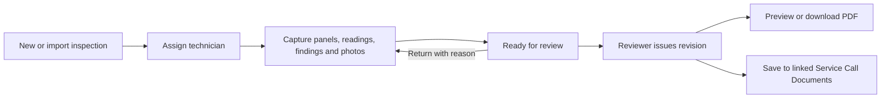

# Electrical Systems Health Inspection — integration plan

**Status:** Implemented locally after Ryan's subsequent “Proceed”; production release remains pending. See [implementation and release evidence](ELECTRICAL_INSPECTION_IMPLEMENTATION.md) and ARCHITECTURE Section 52 for the adopted contracts, which supersede proposed physical table/API names below. This document retains the original design rationale and acceptance scope.
**Date:** 2026-09-14
**Baseline:** main `14488000b72309c3bd076216db9264a27ecf5264`; marker `PINE-ESTIMATE-HIERARCHY-20260914-001`.
**Coordination:** Design review recorded in HANDOFF Entry 240 under ARCHITECTURE v2.30; current review ownership is ARCHITECTURE v2.31, Section 51, HANDOFF Entry 241.
**Scope:** The supplied package, including all service-call, Documents, and optional-on-each-job permit requirements in Section 11.

## 1. Recommendation

Build Electrical Systems Health Inspection as an HQ Add-On Tool, with assigned technician entry and a separate reviewer-issued report. Reuse canonical Jobs for service calls, existing Documents/storage, Clerk identity, the module registry, and existing PDF libraries. Add one shared Permits & Inspections component to regular Jobs and Service Calls.

The product needs new persisted inspection records and a controlled review lifecycle. It cannot be completed as a UI-only binding to Panel Directory. Panel Directory remains an independent schedule/printing tool; an inspection records observations at a particular visit.

This document initially defined the proposed implementation and review questions. The package's assertions of prior approval were treated as supplied requirements to evaluate. Ryan subsequently authorized implementation; the adopted decisions and actual verification are recorded in the implementation document and HANDOFF Entry 242.

## 2. Evidence and current fit

The repository was refreshed with a fast-forward-only pull during this review and remained at the baseline above. All 239 existing HANDOFF entry headings were present, with no gaps or duplicate numbers. Tracked files were unchanged before documentation work; 18 existing untracked `dist-*` directories were preserved.

Read-only catalogue queries inspected the connected `northgate-hq-v2.0` database, project `keogysnoukbendfkfjcn`. No customer rows, credentials, application data, policies, or schema were changed. Latest applied migration was `20260914204755_service_stage_catalogue`.

| Area | Verified current implementation | Required change |
|---|---|---|
| Entry point | `src/modules/registry.js`, `screens.js`, and `App.jsx` route registered modules; Add-On Tools lists modules with `requiresAddon`. The navigation group separately enumerates Panel Directory. | Register `electrical-inspection`, proposed route `/electrical-inspections`, add-on key `electrical_inspection`, and add it to the navigation group. |
| Add-on access | Live `tool_addons` and `tool_addon_access`; `get_current_user_addons`, `current_user_can_access_addon`, and Developer Add-Ons Console already exist. | Add a catalogue record. Existing enable/disable assignment remains the entry gate. Add explicit review authority and record-level access checks. |
| Identity | `usePermissions.js` uses Clerk and existing permission APIs. Live add-on checks use the text JWT subject, `auth.jwt()->>'sub'`. | Preserve this identity model. Do not introduce Supabase Auth users or UUID actor assumptions. |
| Service calls | `jobs.job_type='service_call'`, with `svc_service_profiles.job_id` referencing the canonical job. `svc_save_call` calls `create_job`; users enter call numbers and duplicate numbers are rejected. | Reference `jobs.id`. Reuse the same creation form/validation and server creation function. Add an idempotent create-and-link orchestration. |
| Call Documents | `ServiceCallsWorkspace` hands Documents navigation to `JobsWorkspace` through `onResources`. The job document UI, upload, maintenance, and archive already work for service-call jobs. | Extend this existing section. No second service-call document system or owner type is needed. |
| Document categories | `documentCategories.js` has permits and other categories, but no `service_inspections`. Its shared array also supplies checklist totals and a “Required category” column. | Add Service Inspections as an optional category, with explicit checklist applicability rather than increasing required totals for every project. |
| Storage | Private bucket `northgate-files`. `documents` has owner, file, size/type, timestamps, archive fields and a CO link; no inspection/revision link. The bucket has no configured MIME/size limits. | Add inspection-owned evidence support and a revision-to-job-document relationship. Enforce new upload limits without imposing new bucket-wide restrictions on existing files. |
| Document maintenance | `document_owner_can_manage` and `maintain_owner_document` support job/estimate maintenance. Audit guard prevents owner/path/binary changes and protects signed CO documents. | Deliberately extend the new inspection owner path; preserve existing job/estimate/CO restrictions. |
| Reports | Panel Directory uses browser print. Estimates' `proposalPdf.mjs` generates PDF bytes with pinned `pdf-lib` 1.17.1. | Reuse the installed PDF library and design conventions, not estimate pricing or proposal content. Render preview and download from the same PDF bytes. |
| Permits | A document category exists. No public relation or function named for permits/inspections was found in the live catalogue; no structured permit/inspection workflow was found in the reviewed application. | Add a shared relational model and compact overview/detail UI for both job types. A document category alone cannot track multiple permit records. |

### Access mismatch to resolve during implementation

Job metadata access supports primary and participating departments through `current_user_can_access_job` / `current_user_can_edit_job`. The inspected document-storage policies use division checks. A linked-department user can therefore pass a metadata policy without necessarily passing the corresponding file policy.

This is a concrete integration risk, not a claim that an authenticated failure was reproduced. Test linked-department file access before release. Any required correction must be narrow, use verified parent authority for both metadata and bytes, and retain signed-CO protections. Do not rely on a new permissive policy to narrow an existing broader policy; permissive policies combine with OR.

## 3. User workflow and interface

- Directory: inspection number, client/site, linked job/call, visit date, assigned technician, workflow, highest open priority, updated time. Paginate on the server and filter only authorized records.
- Detail: persistent record header and save state; horizontal **Overview / Equipment / Findings / Photos / Report** tabs.
- Equipment: panel selector and compact Setup, Visual, Thermal, Electrical Readings, and Labeling sections. Preserve unsaved edits during switching; warn before a circuit-count reduction that would remove populated positions.
- Overview: assignment, historical client/site snapshot, scope, access limitations, conditions affecting observations, and the existing/new call actions.
- Toolbar: Save, Submit for Review, or reviewer actions appropriate to current authority/state. Return-for-correction reason appears in a dialog at the action.
- Report: Preview PDF, Download PDF, and Save to Service Call Documents. Use separate “Issued” and “Saved to Documents” states.
- Service-call detail: show linked health inspections and a Documents action using the existing Jobs resource path. Open Inspection routes to its real record.
- Jobs and Service Calls: compact Permits & Inspections overview with identifiers, portal links, upcoming/outstanding attempts, explicit failures, and View All. Include a directory/dashboard summary without turning every row into a large card.
- Phones: scrolling horizontal tabs, readable stacked field groups, photo/camera input, stable panel selection, explicit save failure, and visible unsaved-change protection. Follow the existing 1440/768/390px verification pattern.

Normal job status, work completion, billing, and closeout must remain valid with zero permits and zero inspection records. Empty state: “No permits or inspections added.” This is not a legal determination about permit requirements.

The supplied service definition remains the scope baseline: visual inspection of safely accessible panels/subpanels/service equipment, thermal observations with logged temperatures, and a written safety/code summary with repair recommendations. Quotations are available on request. Complete circuit tracing/relabeling and additional equipment inspection remain explicitly selected optional T&M scope; no automatic charge is posted. Record access limitations and energized/load conditions without importing the prototype's grading thresholds as approved engineering criteria.

## 4. Proposed persistence model

Names below are proposed, not existing database objects or executable migrations. Precise DDL, grants, and policies must be reviewed before implementation. UUIDs identify records; actor/assignee identifiers follow the existing Clerk text identity. Retain text `division` for stored department scope.

| Proposed relation | Core fields and purpose |
|---|---|
| `health_inspections` | `id`, server-assigned inspection number, `division`, optional `job_id`, client/contact/site snapshot, assigned technician, visit date/time with source/time-zone provenance, service scope/limitations, workflow, template version, optimistic `row_version`, creator/updater and soft-archive fields. A current parent is a canonical job, including a service call. |
| `health_inspection_equipment` | `id`, `inspection_id`, order, designator/type/rating/phase data, source references, row version; versioned JSONB for feeders, circuits, checklist responses and readings. Each nested item gets a stable ID and explicit order. Validate the full nested schema server-side. |
| `health_inspection_findings` | `id`, `inspection_id`, optional equipment/checklist reference, category, nullable new priority, retained legacy severity, description/recommendation/code reference, correction status/evidence, version and audit fields. |
| `health_inspection_attachments` | Inspection/equipment/finding links, protected `document_id`, original filename, caption, content hash, upload state and provenance. The document is the file metadata authority; do not maintain a second independent storage catalogue. |
| `health_inspection_revisions` | Unique `(inspection_id, revision_number)`, predecessor, issue reason/actor/time, template and renderer version, immutable client-report snapshot, attachment IDs/hashes, snapshot fingerprint. Exclude private workflow comments and financial information from the client snapshot. |
| `health_inspection_report_documents` | Revision, destination job, actual `document_id`, upload request/state, resulting byte hash, author/time. Unique revision/destination relationship; one document record cannot be claimed by two revisions. This represents delivery/storage, not mutable report content. |
| `health_inspection_imports` | Inspection ID, source document reference, exact source hash and canonical saved-state hash, original filename/version, parser version, importer/time, mapping warnings and approved resolutions. Preserve unknown fields in protected source payloads. |
| `inspection_action_requests` | Unique actor/action/request UUID, payload fingerprint, target inspection, committed result IDs. Used to recognize exact retries of imports, create-and-link, issue and report-save reservations. Changed payload with the same key is rejected. |
| `job_permits` | `id`, `job_id`, permit number as text, optional per-permit URL/type/jurisdiction/status/dates/notes, version and archive/audit fields. Duplicate warnings scoped to parent and jurisdiction; no global permit-number uniqueness. |
| `job_inspections` | `id`, `job_id`, optional same-parent permit, kind, type/name, schedule/completion fields, result, agency/inspector, notes, prior-attempt reference, archive/version fields. Jurisdiction attempts are separate records; health-kind rows reference a health inspection and derive its workflow instead of storing a pass/fail copy. |
| `job_permit_document_links` / `job_inspection_document_links` | Authorized same-parent references to existing Documents, preserving document identity and maintenance history. |

### Relationships and invariants

1. One current owning job/call per health inspection; many health inspections per service call. It may start unlinked. A regular-project link is supported through the same `job_id`; switching to a service call is an explicit, audited parent change with a before/after confirmation. Prior links and issued report snapshots remain historical evidence.
2. No second job number, customer master, service-call parent table, or financial ledger. An inspection number is an independent identifier, with a database sequence/uniqueness guarantee, never `max()+1` or a service-call number.
3. Parent changes revalidate scope and child permit/document relationships together. Reject cross-parent references rather than silently moving permits or existing documents. Archived parents are read/history-only; new links and mutations require active authorized parents.
4. A health-kind `job_inspections` row is only a reference: its `health_inspection_id` and job must match the canonical health inspection. Its jurisdiction result fields stay null. Link/unlink updates the reference atomically. A Northgate issue event never marks a permit Passed or Closed.
5. Equipment/finding/attachment links must belong to the same inspection. Foreign keys and ownership validation cover direct API requests. Index parent/assignee/status lookups and foreign-key columns used by directory and child queries.
6. Archive is separate from workflow; no destructive customer-record deletion is introduced. Referenced issued evidence cannot be replaced or removed so that an existing revision becomes irreproducible.
7. Every mutation checks an expected version and server-resolved identity. Save and audit succeed together or roll back together. Routine field capture need not ask for a reason on every save; assignment/link changes, return, archive/restore and new issued revisions carry the appropriate action-time reason.
8. Template revisions govern expected measurements. Completion counts explicit responses, and distinguishes measured from documented exceptions. Blank is not zero. Completion never supplies an engineering pass/fail result.

The equipment JSONB choice follows the existing panel model while avoiding a table per cell. Findings, files, revisions and permits remain separately addressable because they need independent links and lifecycle rules. Field-by-field import mapping is in [the companion review](ELECTRICAL_INSPECTION_LEGACY_MAPPING.md).

## 5. Proposed authority matrix

Reuse add-on assignment for tool entry. Introduce the canonical capability **`can_review_electrical_inspections`** through HQ's existing effective-permission/template/override system; default false for ordinary roles. Recommend explicit reviewer assignment, initially the chosen Ryan account, with no hard-coded name or role-based assumption that every supervisor can issue.

| Action | Proposed server requirements |
|---|---|
| Enter tool / create own unlinked draft | Active signed-in user, enabled inspection add-on, authorized department. Creator becomes initial technician unless an authorized assigner chooses otherwise. |
| Read/capture draft | Add-on access, parent/department scope, and creator/assigned-technician relationship; in-scope managers and reviewers may also read. Assignment never grants access to an otherwise unauthorized parent. |
| Assign/reassign technician | Add-on access plus existing `can_manage_jobs` in parent/department scope. Validate the target as an active user with add-on access and eligible scope through a safe target-scoped lookup. Do not call a caller-scoped permission API as though it checked another user. |
| Submit | Authorized draft editor; required identity/equipment data and explicit dispositions validated. Submission freezes that review candidate. |
| Return / issue / create issued revision | Add-on, new reviewer capability, authorized scope, expected version and required disposition/reason. Job-management, budget-approval and estimate-approval permissions do not imply review authority. |
| Link existing call | Inspection link-management authority plus read access to active target call; optional stricter job-edit requirement is a review decision. Show client/site mismatch and require explicit acknowledgement. No financial permissions gained. |
| Create call and link | Above plus canonical `can_create_jobs` and the existing create function's scope/validation. Field users without that capability can continue the inspection and have a manager create/link the call. |
| Save issued report to call Documents | Reviewer/report authority and existing destination document-management authority. Entry-level add-on access does not grant general job document upload rights. External inspection PDFs use the normal authorized job upload. |
| Permits / jurisdiction attempts | Existing parent read gate; changes use `current_user_can_edit_job(...,'can_manage_jobs')`; archive additionally follows `can_archive_records`. No add-on required for ordinary permit tracking. |
| Read saved client report | Existing authorized job Documents access. Raw working observations, original import payloads and private review notes stay under inspection-specific access. |

Permission work includes effective resolution, default-deny frontend mapping, templates/overrides, SQL validation and Developer presentation. Inspect the live resolver and its dependencies before editing; the architecture header describes older signatures and is not a substitute for the live definition. Preserve all existing permission keys/defaults.

## 6. Lifecycle, immutable reports, and evidence

`draft -> in_progress -> ready_for_review -> issued`. Return sends a review candidate back to in_progress with a stored reason. Archive does not invent another workflow status. After issue, editing creates a working revision linked to the last issued revision; the prior snapshot is immutable.

Issue validates identity/site/equipment data, findings disposition, new priority where required, and measurement states. It may include explicitly unassessed/inaccessible items with reasons, prominently shown. Unresolved High concerns stay prominent regardless of completion percentage. Final assessment is reviewer-entered; no replacement temperature/voltage thresholds are introduced.

Use a dedicated `inspectionPdf.mjs` built on the installed `pdf-lib`. Report order: branding/metadata, scope/limitations, reviewer summary and priority counts, equipment inventory, the three requested finding categories, all equipment details, captioned evidence, reviewer/revision information. Share the report data model with preview, and preview the same bytes offered for download/upload. Do not reuse estimate financial calculations.

Freeze report-visible captions, evidence hashes, company contact/branding text, renderer version and data in the issue snapshot. Keep the actual issued PDF after successful storage; reopening it must retrieve those bytes, not rebuild it from edited live data. Before upload completes, show “Issued — PDF not saved” and retain an honest retry path. A stored PDF association alone is not proof of a successful upload.

Renderer validation must cover long tables, photos, Unicode/symbol handling, units, voltage pairs and multiple pages. The existing proposal renderer demonstrates a library choice, not a complete inspection-layout engine. Do not make silent text substitutions that change measurements or names.

## 7. Create/link retry contract

The live `svc_save_call(p_job_id,p_data,p_expected_updated_at)` has number uniqueness, a transaction lock and stale-edit checks. It has no creation request key; a lost successful response produces a duplicate-number error on retry, not recovery of the original created ID. `ServiceCallsWorkspace` also lacks an external creation-prefill/result contract.

Proposed change:

1. Extract the existing create/edit form into a reusable service-call form while retaining the current standalone flow and validation.
2. Add optional initial values and explicit created/cancel callbacks. Do not prefill unknown billing choices, split an ambiguous address silently, or overwrite customer snapshots.
3. Add `create_health_inspection_service_call(request_id, inspection_id, expected_version, call_data)`, a controlled orchestration that calls the existing `svc_save_call` creation path, links the result, records audit, and commits a request receipt in one database transaction.
4. Verify current authority even on replay. An exact authorized replay returns the same call ID; changed payload with the same key fails. Creation/link/audit failure rolls back the whole transaction. After a lost response, the same request recovers the result.
5. If a supported non-atomic existing flow returns a created ID before a link failure, persist that ID in recoverable inspection context and offer Link Retry only. Never restart creation from that state.

Use existing `/jobs` navigation state (`openJobId`, `directoryType`) for Open Service Call. Add a durable inspection record URL/query parameter for the new workspace rather than depending only on ephemeral component state.

## 8. Documents and uploads

### Owner/category model

- Issued call report: `documents.owner_type='job'`, `owner_id=jobs.id`, `document_type='service_inspections'`.
- Unlinked draft photos/import source: proposed `owner_type='health_inspection'`, with the real inspection UUID. Extend the owner CHECK, protected file policies, maintenance helper and audit guard deliberately; a currently declared `report` owner is not evidence of working access support.
- Permit PDFs and external jurisdiction results use job-owned Documents and relationship records. Do not duplicate a file merely because it appears in two relevant views.
- Make the Service Inspections category optional in shared checklist calculations. Existing document behavior outside the new category must be covered by regression tests.

### Reserve / upload / finalize

Reserve a stable document ID/path through an authorized request; upload the immutable object with `upsert:false`; finalize only after actual object existence, size/type and content hash verification. For report saves, require an issued revision and authorized destination. Store one revision/destination association and recover its status on retry.

The database checks object metadata and linkage; it does not inspect PDF semantics or compute a hash from remote binary content. The authorized upload client must read the protected object back and compare its digest with the generated bytes before reporting verified save success. Record that digest as publisher-supplied provenance, not as a server certification that the PDF text matches the snapshot. Server-certified rendering would require a separately reviewed server-rendering endpoint. The initial proposal uses the same authorized-publisher model as existing document uploads, with an immutable server-issued data snapshot and verified application read-back.

The database transaction cannot include the storage upload. Explicit pending/failed/ready states are required. Reuse `archiveFailedDocument` where the existing upload path needs compensation; extend owner support where necessary. An uncertain response must trigger a status check, not a fresh document ID. Missing bytes must never be reported as saved. Background cleanup, if added, may remove only verified abandoned reservations under a documented retention rule.

Restrict new inspection paths to approved image/PDF/JSON/HTML-source MIME/size combinations; inspect magic bytes and image dimensions. HTML imports are stored/downloaded as inert source evidence and never rendered inline as executable HTML. Recommended initial limits are a product/implementation review item, not assumed existing bucket controls.

Reports saved under job Documents inherit that audience. Original sources and draft attachments must not become department-wide job documents simply to get an upload working. Maintain private access for source material, including after reassignment/archive; protect immutable issued references from destructive cleanup.

## 9. Permits & Inspections contract

- Both job types may have any number of permits/attempts, including zero.
- Permit number is required only when intentionally saving a permit record. Preserve punctuation and leading zeros. URLs are independently optional per permit; accept HTTP/HTTPS, reject executable schemes, open with safe external-link attributes, and retain the user-entered destination. No portal credential storage, scraping or synchronization.
- Proposed permit statuses: Applied, Issued, Closed, Expired, Cancelled; optional dates/jurisdiction/type/notes. Each row has independent edits/version and audit.
- Jurisdiction inspection fields: type/name, optional same-parent permit, schedule with timezone, completion date, agency/inspector, notes, supporting Documents. Keep schedule state distinct from result: an unscheduled or scheduled record has no pass/fail result.
- A failed attempt remains recorded. A reinspection points to the prior attempt; do not rewrite Failed to Passed and erase the earlier event.
- Health-kind references open the actual add-on inspection/revision. They cannot carry jurisdiction results or drive permit closure.
- Overview summaries and full details use the same authorized reader and invalidation after writes. Failed results remain explicit, including when a later attempt passes.
- Do not infer that adding a permit expense to Financials created a permit record, or that permit tracking posts a cost.

## 10. Concrete file map

All paths below are repository-relative proposals. Existing files were located at the baseline; proposed new files are not created by this review.

| Files | Planned work |
|---|---|
| `src/modules/registry.js`, `src/modules/screens.js` | Register the gated add-on screen and navigation group. Existing App route generation can serve the workspace; modify `src/App.jsx` only if the reviewed record URL requires an explicit nested route. |
| `src/hooks/usePermissions.js`, `src/modules/developer/PermissionTemplates.jsx` | Add deny-by-default reviewer capability and verify whether its permission list is generated or needs an explicit entry. Keep add-on assignment in `DeveloperAddonsConsole.jsx`; adapt only if new status presentation is needed. |
| New `src/modules/electrical-inspections/ElectricalInspectionsWorkspace.jsx`, `InspectionEditor.jsx`, `EquipmentEditor.jsx`, `FindingsEditor.jsx`, `InspectionPhotos.jsx`, `InspectionReview.jsx`, `LegacyImportPreview.jsx`, `electricalInspections.css` | Directory, horizontal record detail, field/review lifecycle, protected evidence and responsive UI. Reuse existing WorkspaceHeader, RecordHeader, WorkspaceTabs, DataTable, ConfirmDialog and state controls. |
| New `src/modules/electrical-inspections/inspectionModel.js`, `inspectionApi.js`, `legacyInspectionImport.js`, `inspectionReport.js`, `inspectionPdf.mjs` | Blank/validation model, controlled server calls, inert import and mapping, frozen client-report projection, PDF rendering. |
| `src/modules/service-calls/ServiceCallsWorkspace.jsx`; new `ServiceCallForm.jsx` in that folder | Extract canonical creation form and add prefill/result/retry integration. Show health inspection links and permit quick reference. Preserve stages, scorecard, billing and existing callbacks. |
| `src/modules/jobs/JobsWorkspace.jsx` | Shared Permits & Inspections detail tab and quick reference, including the service-call tab allowlist; resource navigation, refresh and report-document integration. |
| New `src/modules/jobs/permits/PermitsInspections.jsx`, `PermitsInspectionsSummary.jsx`, `permitInspectionModel.js`, `permitInspectionApi.js` | Shared multi-permit/attempt CRUD, safe URLs, explicit kind/result handling and summary reader. |
| `src/modules/documents/documentCategories.js`, `DocumentsWorkspace.jsx`, `DocumentMaintenance.jsx`, `documentUploadCleanup.js`; new `documentUploadWorkflow.js` | Optional category applicability, inspection owner maintenance, reusable recoverable upload orchestration, revision association and safe reopen. Jobs' current upload handler is reused/extracted, not copied into a second subsystem. |
| Future files under `supabase/migrations/` | Reviewed inspection foundation/access/audit; owner/storage/revision upload contracts; service-call create/link receipts; shared permit/inspection relations and APIs. Generate filenames using the CLI when implementation is authorized. No invented migration version or SQL applied in this plan. |
| Future `tests/electricalInspection*.test.js`, `tests/electricalInspection*.sql`, `tests/jobPermits*.test.js`, `tests/jobPermits*.sql`, synthetic `tests/fixtures/` inputs, `scripts/verify-electrical-inspections.mjs`, `scripts/verify-job-permits.mjs` | Invariants, direct-request denial, rollback/concurrency/replay, import, PDF and responsive journeys. Extend existing service-call and document regression suites. |
| `docs/ARCHITECTURE.md`, `HANDOFF.md`, `SYNC_STATUS.md` at the appropriate later stages | Lock only approved decisions; append implementation/review evidence; update durable release marker only for an actual release. This plan changes neither the lock document nor the current sync marker. |

## 11. Implementation sequence and acceptance gates

1. **Design review in Codex:** confirm authority and parent model, upload/revision contract and detailed data shape; reconcile the live storage/metadata scope difference. Follow ARCHITECTURE Sections 35/51 within Ryan's authorized scope. No separate Claude review is required; this proposal is not automatically an adopted feature lock.
2. **Foundation and field entry:** blank creation, assignment, save/version/audit behavior, equipment, checklist, measured/exception states, findings and protected photos. Reload and failure recovery must work before expanding the workflow.
3. **Legacy import and reports:** both JSON shapes and inert HTML extraction, preview/deduplication/provenance, return/issue/revision, all-panel PDF, frozen evidence and genuine saved files.
4. **Service-call integration:** existing/new call, canonical creation/retry, two-way links, Service Inspections category and idempotent issued-report saving. Include this in the delivery; do not defer it because a new server contract is needed.
5. **Permits & Inspections:** same shared functionality on ordinary Jobs and Service Calls; multiple permits/URLs and independent attempts, parent authorization and document links. Tracking is optional on each record, not optional implementation scope.
6. **Combined verification and pilot:** synthetic automated data; then one explicitly selected private imported inspection and one new inspection through technician entry, correction, issue and reopening saved reports. Pilot identities/assignments require actual selected accounts, not name matching from the package.
7. **Release:** production-configured build, approved migration/release sequence, permission grants and representative authenticated acceptance. Commit/push/deploy and import of real customer records are separate future actions, not performed by this planning task.

| Acceptance group | Required evidence |
|---|---|
| Source preservation | All six source panels and every saved supported value round-trip; unknown keys retained; no automatic priority mapping; explicit discrepancy resolutions. Private real-data validation stays outside tracked/public fixtures. |
| Safe import | Malformed/oversized files, unsafe HTML, unknown versions, ambiguous dates, images, duplicate/replayed imports, single-panel legacy, blank/zero and changed request payloads. No script execution or source-derived default records. |
| Field capture | Save/reload, panel switching, populated-circuit reduction, failed save/upload retention, simultaneous edits, assignee revocation and no false Saved state. |
| Access | Active/disabled accounts, no add-on, assigned/unassigned techs, manager/reviewer, other department and linked department, direct RPC/table/storage requests, anonymous roles, archived parents and cross-parent child links. |
| Review / report | Missing readings visible; High findings prominent; category/priority/severity distinct; return reason; review freeze; old revisions unchanged after edits; all panels, long content, images, units, symbols and page breaks. |
| Call lifecycle | Cancellation preserves inspection; lost response replay returns same created call; link/audit failure rollback; no duplicate call-number generator; existing stages/financial rules unchanged. |
| Documents | Save then reopen real PDF, same revision retry yields one entry, next revision preserves previous PDF, object missing/failed/pending cases, job audience versus private draft/source audience, existing edit/archive/restore/signed-CO protection. |
| Permits | Zero-entry save/progress/close for both job types; two permits with distinct URLs; independent edits; safe schemes; same-parent optional permit link; failed/reinspection history; no automated Passed/Closed propagation. |
| Regression / UI | Current Node tests and relevant service/document/estimate fixtures; meaningful rollback-only database suites in the approved test environment; 1440/768/390px interactions; real-device camera and authenticated pilot acceptance. |

## 12. Decisions to confirm with the design

| Decision | Recommended default | Reason |
|---|---|---|
| Review/issue authority | Explicit `can_review_electrical_inspections`, initially assigned to the selected Ryan account; ordinary technician add-on access remains separate. | Delegation without granting every field user report-issue authority. |
| Draft visibility | Assigned technician/creator and authorized in-scope managers/reviewers; issued job Documents use the existing job audience. | Protect working notes/source records while distributing completed reports normally. |
| Parent ownership | One optional current job/call per inspection; explicit audited relink. | Keeps service-call ownership, permits and document destinations unambiguous. |
| Saving reports | Existing PDF library, same-byte preview/export, real Documents upload with reserve/finalize/retry. | Removes a manual print-then-find-file step while making saved state truthful. |
| Technician call creation / document upload | Keep existing job-create/document-management requirements. Reviewer/manager handles actions outside technician authority. | Avoids granting broader operational powers merely by enabling the inspection tool. |
| Connectivity | Online saved records with recoverable in-session drafts and explicit unsaved warnings; offline synchronization is not included in this first design. | A durable offline queue is an additional conflict/identity/storage design. Confirm before implementation if job sites require it. |
| Initial file limits | Set explicit import/photo/report limits in the reviewed upload contract, based on representative thermal images; do not silently downsample originals. | Current bucket settings do not supply these limits. |

## 13. Review status and sources

This completed work is a documentation review of a Bucket 3 proposal. New tables, permissions, policies, backend functions and cross-module write behavior remain proposed. Ryan retired mandatory Claude review after this plan was prepared. [ARCHITECTURE Section 51](../ARCHITECTURE.md#51-architecture-review-ownership-v231--entry-241) now assigns architecture review and authorized implementation to Codex. Entry 240's external-review conclusion is superseded; no separate reviewer approval is needed. Material unresolved product decisions remain Ryan's, and removal of the review gate does not itself adopt the full feature proposal.

Sources inspected: supplied ZIP README/spec/manifest and inert source state; current registry/screens/permissions; Jobs and Service Calls workspaces; Documents category/upload/maintenance; Panel Directory; proposal PDF; relevant migrations and HANDOFF; live read-only catalogue/functions/policies/bucket metadata. The prototype was not executed, no source data imported, and no live authenticated UI acceptance was performed.

The current Supabase [changelog](https://supabase.com/changelog) was checked using its HTML version after the Markdown endpoint could not be fetched. Relevant implementation guidance: explicit Data API grants from [securing the API](https://supabase.com/docs/guides/api/securing-your-api), file access governed by [Storage access control](https://supabase.com/docs/guides/storage/security/access-control), and existing third-party identity behavior from [Clerk integration](https://supabase.com/docs/guides/auth/third-party/clerk). These do not authorize an authentication migration in this task.

**Current review status:** Architecture review continues in Codex under the authorized task; no mandatory external review (ARCHITECTURE v2.31, HANDOFF Entry 241).
